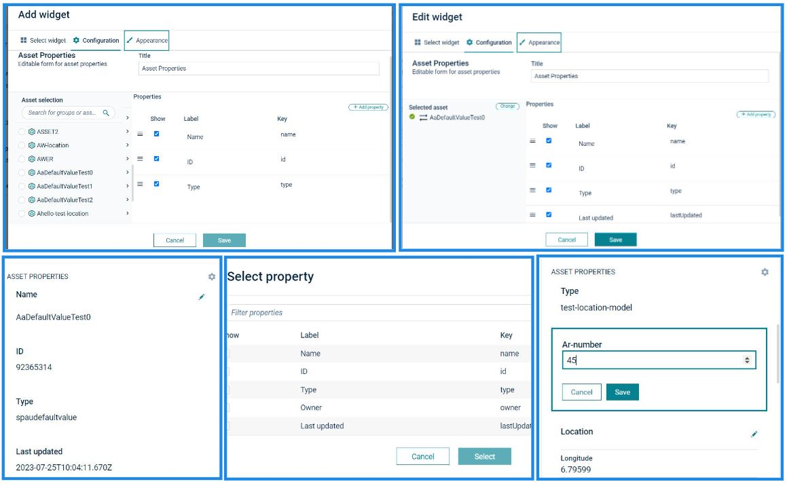

# Cumulocity Asset Properties Widget Plugin 

This Asset Properties Widget is the Cumulocity module federation plugin created using c8ycli. This plugin can be used in Application Builder or Cockpit. It fetches Inventory data based on the Asset or Devices and displays the same in a widget.

### Compatibility:

| ASSET PROPERTIES WIDGET PLUGIN | CUMULOCITY |
| ------------------------------ | ---------- |
| 1.0.0                          | 1018.0.144 |

## Features

- **Display Asset/Device list:** Displays Asset and Device list present in the tenant.

- **Configurable Properties:** User can choose what properties to display and also option to display custom label for each property.

## Prerequisites:

Cumulocity c8ycli >=1018.0.144

## Installation

To install the Asset properties 2.0 widget plugin, you must add the plugin package to the extensions first and then install it on the desired custom application.

#### To add the plugin package to extensions

1.  Navigate to Administration > Ecosystem > Extensions
2.  Click **Add extension package** to upload the zip file

#### To install the widget plugin on a custom application

1. Navigate Adminstration > Ecosystem > Applications
2. Click application name to view the application details.
3. Switch to **Plugins** tab, Click **Install plugins**
4. In the resulting dialog, search for Asset properties 2.0 widget, click **Install**

To know more about extensions, see [Administration> Managing applications > Extensions](https://cumulocity.com/guides/users-guide/administration/#extensions) in _User guide_

Note: You need a custom application with Cumulocity IoT dashboard to see the widget in action. A quick way to achieve this is by creating a custom Cockpit application.
To create a custom Cockpit application, follow the steps below:

1. Navigate to Administration > Ecosystem > Applications
2. click **Add application**.
3. In the resulting dialog, select the option **Duplicate existing application**.
4. From the list of applications, select Cockpit (Subscribed). Use the default values and proceed.

## QuickStart

This guide will teach you how to add widget in your existing or new dashboard.

1. Open your application from App Switcher

2. Add new dashboard or navigate to existing dashboard

3. Click `Add Widget`

4. Search for `Asset Properties 2.0`

5. Select `Target Asset` or `Target Device`

6. Add Property by clicking `Add Property` button.

7. Click `Save`

Congratulations! Asset Properties is configured.

---

These tools are provided as-is and without warranty or support. They do not constitute part of the Software AG product suite. Users are free to use, fork and modify them, subject to the license agreement. While Software AG welcomes contributions, we cannot guarantee to include every contribution in the master project.

---

For more information you can Ask a Question in the [TECH Community Forums](https://tech.forums.softwareag.com/tag/Cumulocity-IoT).
